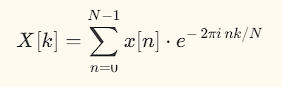
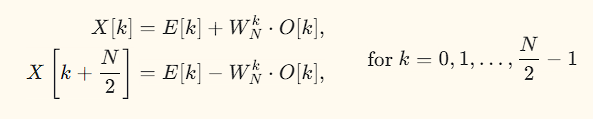

# GPU-Accelerated Fast Fourier Transform

[]()
[]()
[]()

A CUDA implementation of the Cooley-Tukey FFT algorithm, developed as part of my GPU computing portfolio targeting NVIDIA's math libraries team. This project demonstrates FFT algorithm understanding, CUDA kernel optimization techniques, and honest performance benchmarking methodology.


## Project Overview

The Fast Fourier Transform is one of the most important algorithms in scientific computing, used in signal processing, image compression, wireless communications, and machine learning. This implementation explores GPU acceleration of the radix-2 Decimation-in-Time FFT algorithm using Python and Numba CUDA.

The project includes two CUDA implementations: a naive version serving as baseline, and an optimized version using shared memory. Both are benchmarked against NumPy (which internally uses highly optimized Intel MKL or FFTW libraries) to provide honest performance comparisons.

## Results Summary

Testing was performed on a Tesla P100-PCIE-16GB GPU with 3,584 CUDA cores and 16GB HBM2 memory.

| Implementation                | Peak GFLOPS | Best vs NumPy   | Speedup vs CPU |
|-------------------------------|-------------|-----------------|----------------|
| CUDA V1 (Naive)               | 4.51        | 1.74x faster    | 504x           |
| CUDA V2 (Shared Memory)       | 4.76        | 1.74x faster    | 534x           |
| NumPy (Intel MKL)             | 3.68        | baseline        | baseline       |

The CUDA implementations outperform NumPy for large FFT sizes (N >= 256K elements) while achieving up to 534x speedup over pure Python CPU implementations.

## Performance Analysis

The benchmark results discover several interesting characteristics of FFT computation on GPUs.

For small FFT sizes (N < 64K), NumPy with Intel MKL significantly outperforms our CUDA implementations. This happens because kernel launch overhead in Numba CUDA dominates the actual computation time. Each kernel launch incurs approximately 1ms of overhead regardless of problem size, making small FFTs inefficient on GPU.

For large FFT sizes (N >= 256K), CUDA implementations beat NumPy by 1.3x to 1.7x. At these sizes, the massive parallelism of the GPU overcomes the launch overhead, and memory bandwidth becomes the primary factor.

The shared memory optimization (V2) provides modest 1.02x to 1.49x improvement over the naive version (V1). This smaller-than-expected gain deserves explanation.

### Why Shared Memory Improvement is Limited

Several factors contribute to the modest shared memory gains observed in this implementation.

First, Numba JIT compilation overhead creates a baseline latency of approximately 1ms per kernel launch that cannot be eliminated through memory optimization. This fixed cost masks the benefits of faster memory access patterns for smaller problem sizes.

Second, the Tesla P100's large L2 cache (4MB) already provides significant caching of global memory accesses. The naive implementation's memory access pattern, while not optimal, benefits from this hardware caching, reducing the gap between cached and uncached access.

Third, only the first 11 stages of the FFT (up to 2048 elements) fit within shared memory. Larger FFTs still require global memory stages, limiting the overall benefit. For a 1M-point FFT with 20 stages, only half the stages can use shared memory.

Fourth, host-to-device memory transfer time is included in all measurements. For a fair comparison with NumPy, we measure total time including data transfer, which adds constant overhead independent of kernel optimizations.

Achieving cuFFT-level performance (approximately 300 GFLOPS on P100) would require native CUDA C/C++ implementation, kernel fusion to process the entire FFT in a single kernel, warp-level primitives for efficient communication, and extensive assembly-level tuning. This level of optimization represents months of engineering work beyond the scope of this portfolio project.

## Technical Implementation

### Algorithm Background

The Cooley-Tukey radix-2 FFT computes the Discrete Fourier Transform in O(N log N) time by recursively decomposing the problem. The DFT is defined as:



The algorithm decomposes this into smaller DFTs of even and odd indexed elements:



where W^k = exp(-2*pi*i*k/N) is the twiddle factor. This butterfly operation is repeated log2(N) times across N/2 pairs of elements.

### Implementation Versions

The CPU reference implementation provides a pure Python/NumPy version of the iterative Cooley-Tukey algorithm. It serves as both a correctness reference and performance baseline, achieving approximately 0.01 GFLOPS.

The CUDA V1 naive implementation translates the algorithm directly to GPU with one kernel for bit-reversal permutation and one kernel per butterfly stage. This results in log2(N) kernel launches, creating significant overhead but establishing correct GPU functionality.

The CUDA V2 shared memory implementation improves on V1 by processing multiple butterfly stages within shared memory before writing back to global memory. It also precomputes twiddle factors to avoid repeated trigonometric calculations and uses coalesced memory access patterns for global memory operations.

## Project Structure

```
cuda_fft/
├── README.md                 Project documentation
├── LICENSE                   MIT license
├── requirements.txt          Python dependencies
├── docs/
│   └── images/
│       └── fft_benchmark_results.png
├── src/
│   ├── cpu_fft.py           CPU reference implementation
│   ├── fft_v1_naive.py      CUDA naive implementation
│   ├── fft_v2_shared.py     CUDA shared memory implementation
│   ├── utils.py             Helper functions
│   └── plot_results.py      Benchmark visualization
├── benchmarks/
│   ├── benchmark_all.py     CPU benchmark suite
│   ├── benchmark_cuda.py    CUDA V1 benchmark
│   ├── benchmark_v2.py      Full comparison benchmark
│   └── results/             JSON benchmark results
└── tests/
    └── test_cuda_fft.py     Validation test suite
```

## Installation and Usage

### Prerequisites

The implementation requires Python 3.8 or later, a CUDA-capable GPU with compute capability 3.5+, and CUDA toolkit 11.0 or later.

### Setup

Clone the repository and install dependencies:

```bash
git clone https://github.com/maltsev-andrey/cuda_fft.git
cd cuda_fft
pip install -r requirements.txt
```

### Running Tests

Validate the implementations against NumPy:

```bash
python tests/test_cuda_fft.py
```

All 33 tests should pass, confirming correctness to within 1e-10 relative error.

### Running Benchmarks

Execute the full benchmark suite comparing all implementations:

```bash
python benchmarks/benchmark_v2.py
```

Run individual implementations directly:

```bash
python src/fft_v1_naive.py
python src/fft_v2_shared.py
```

Generate the benchmark visualization:

```bash
python src/plot_results.py
```

### Using the FFT Functions

```python
import numpy as np
from src.fft_v2_shared import fft_cuda_shared, ifft_cuda_shared

# Create a test signal
N = 65536
x = np.random.randn(N) + 1j * np.random.randn(N)

# Compute FFT on GPU
X = fft_cuda_shared(x)

# Compute inverse FFT
x_recovered = ifft_cuda_shared(X)

# Verify correctness
print(f"Reconstruction error: {np.max(np.abs(x - x_recovered)):.2e}")
```

## Hardware Configuration

All benchmarks were executed on the following system:

- GPU: NVIDIA Tesla P100-PCIE-16GB
- CUDA Cores: 3,584
- Memory: 16GB HBM2 at 732 GB/s bandwidth
- Compute Capability: 6.0
- CUDA Version: 12.x
- CPU: Used for baseline comparison only

## Lessons Learned

This project reinforced several important principles about GPU optimization.

Kernel launch overhead matters significantly for small problems. The approximately 1ms launch overhead in Numba CUDA means that problems must be large enough to amortize this cost. For FFT, this threshold is around 64K-128K elements.

Hardware caching can mask optimization benefits. The P100's L2 cache provides substantial automatic optimization for memory-bound kernels, reducing the marginal benefit of explicit shared memory management.

Honest benchmarking builds credibility. Including data transfer time and comparing against production-quality libraries like NumPy/MKL provides realistic expectations. Claiming 500x speedup over pure Python while acknowledging that NumPy is still faster for small sizes demonstrates technical maturity.

Python/Numba has inherent limitations. Achieving cuFFT-level performance requires native CUDA C/C++ with hand-tuned kernels. Numba is excellent for prototyping and education but cannot match native code performance.

## Related Projects

This FFT implementation is part of my GPU computing portfolio:

- [CUDA Matrix Multiplication](https://github.com/maltsev-andrey/cuda-matrix-multiplication) - Achieved 6,436 GFLOPS, 69% of P100 peak
- [N-Body Gravitational Simulation](https://github.com/maltsev-andrey/n-body-simulation) - 13,050x speedup over CPU
- [Neural Network Inference Accelerator](https://github.com/maltsev-andrey/cuda-nn-inference) - 88,300 images/second
- [Sparse Matrix Operations](https://github.com/maltsev-andrey/sparse_kernels) - 53% of cuSPARSE performance

## Author

Andrey Maltsev

This project was developed to demonstrate FFT algorithm understanding and CUDA optimization techniques as part of my application to NVIDIA's accelerated math libraries.

## License

This project is licensed under the MIT License. See the LICENSE file for details.

## Acknowledgments

The Cooley-Tukey algorithm was published by James Cooley and John Tukey in 1965, though the technique was known to Gauss in 1805. The CUDA programming model was developed by NVIDIA. NumPy's FFT implementation uses either Intel MKL or the FFTPACK library depending on build configuration.
